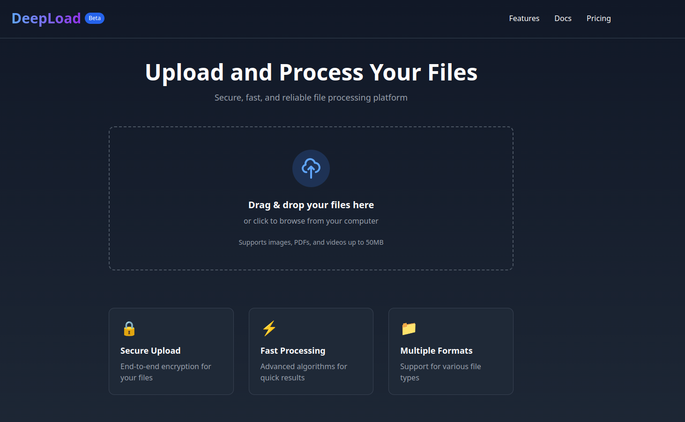

# DeepLoad - File Upload Documentation

## Overview
DeepLoad is a modern file upload platform that allows users to securely upload and process various file types including images, PDFs, and videos.

## Demo Screenshot

[https://deepload.vercel.app]

## Features
- Drag & drop file upload
- Multiple file support
- File type validation
- Size limit checks
- Progress tracking
- Secure file processing
- Beautiful UI/UX

## Supported File Types
- Images: .jpg, .jpeg, .png, .gif, .webp
- Documents: .pdf
- Videos: .mp4, .mov
- Archives: .zip

## Usage
1. Drag files into the upload zone or click to browse
2. Selected files appear in the upload queue
3. Click "Process" button to start upload
4. Files are validated and processed securely
5. Success/error notification appears

## Technical Details
- Built with Next.js 13+
- Uses react-dropzone for drag & drop
- Server-side file validation
- Unique file naming with UUID
- Configurable max file size (100MB default)
- Public uploads directory storage

## API Endpoints

### POST /api/upload
Upload one or multiple files

Request:
```multipart/form-data
files: File[]
```

Response:
```json
{
  "message": "Files uploaded successfully",
  "files": [
    {
      "originalName": "example.jpg",
      "fileName": "uuid.jpg",
      "fileUrl": "/uploads/uuid.jpg",
      "fileType": "image/jpeg",
      "fileSize": 1024
    }
  ]
}
```

## Security
- File type validation
- Size limits
- Unique file names
- Proper error handling
- Secure file storage

## Future Improvements
- Cloud storage integration
- Image optimization
- File compression
- Progress bars
- Preview thumbnails

## Example Implementation
See the full source code in the repository for detailed implementation examples.

## License
MIT License - free to use and modify
